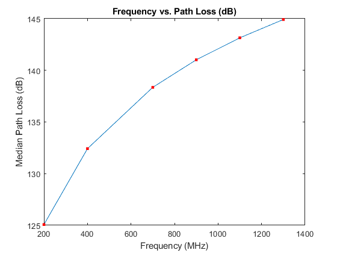
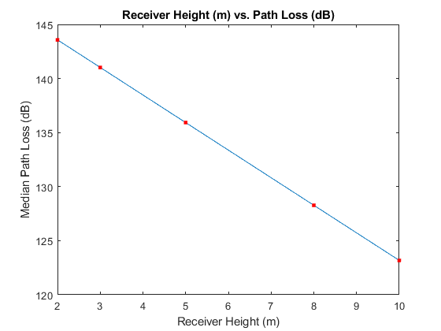

# WMC.Lab

<!DOCTYPE html
  PUBLIC "-//W3C//DTD HTML 4.01 Transitional//EN">
<html><head>
      <meta http-equiv="Content-Type" content="text/html; charset=utf-8">
   <!--
This HTML was auto-generated from MATLAB code.
To make changes, update the MATLAB code and republish this document.
      --><title>Task4</title><meta name="generator" content="MATLAB 9.13"><link rel="schema.DC" href="http://purl.org/dc/elements/1.1/"><meta name="DC.date" content="2024-09-25"><meta name="DC.source" content="Task4.m"></head><body>
<h2>Contents</h2>
<ul><li><a href="#1">Okumura Model</a></li><li><a href="#2">Okumura: Median Path Loss</a></li><li><a href="#3">Okumura: Frequency vs Path loss</a></li><li><a href="#4">Okumura: Transmitter Antenna Height vs. PathLoss</a></li><li><a href="#5">Okumura: Receiver Antenna Height vs. PathLoss</a></li><li><a href="#6">Okumura: Various Environment vs. Median Path Loss</a></li><li><a href="#7">Hata Model for Urban Small City</a></li><li><a href="#8">Hata: Median Path Loss</a></li><li><a href="#9">Hata: Frequency vs. Path Loss</a></li><li><a href="#10">Hata: Transmitter Antenna vs. Path Loss</a></li><li><a href="#11">Hata: Receiver Antenna vs. Path Loss</a></li><li><a href="#12">Hata: Path Loss for small, medium and large city</a></li><li><a href="#13">Okumura vs. Hata</a></li></ul>
<h2 id="1">Okumura Model</h2><pre class="codeinput">clc;
clear all;
close all;
</pre><h2 id="2">Okumura: Median Path Loss</h2><pre class="codeinput">f = 900*10^6;
d = 50*10^3;
lambda = (3*10^8)/f;
hte = 1000;
hre = 10;

FSPL = 20*log10(4*pi*d/lambda);
Ghte = 20*log10(hte/200);
if(hre&lt;=3)
    Ghre = 10*log10(hre/3);
else
    Ghre = 20*log10(hre/3);
end

Amu = 42; % from Graph
Garea = 8; % from Graph

PLm = FSPL+Amu-Ghte-Ghre-Garea;
fprintf('%s %f %s\n','The median path loss:',PLm,'dB');
</pre><pre class="codeoutput">The median path loss: 135.069047 dB
</pre><h2 id="3">Okumura: Frequency vs Path loss</h2><pre class="codeinput">clc;
clear all;
close all;
f = [200*10^6,400*10^6,700*10^6,900*10^6,1100*10^6,1300*10^6];
d = 50*10^3;
hte = 100;
hre = 10;
Ghte = 20*log10(hte/200);
if(hre&lt;=3)
    Ghre = 10*log10(hre/3);
else
    Ghre = 20*log10(hre/3);
end

lambda = zeros(1,6);
Amu = [38,40,41,42,44,45];
Garea = [6,7,8,9,10,10.5];
PLm = zeros(1,6);

for i=1:6
    lambda(i) = (3*10^8)/f(i);
    FSPL = 20*log10(4*pi*d/lambda(i));
    PLm(i) = FSPL+Amu(i)-Ghte-Ghre-Garea(i);
end

plot(f,PLm,"Marker",".","MarkerEdgeColor","Red","MarkerFaceColor",[1 .6 .6],"MarkerSize",10);
xlabel("Frequency(Hz)");
ylabel("Median PathLoss (dB)");
title("Frequency vs. Median PathLoss");
</pre> <h2 id="4">Okumura: Transmitter Antenna Height vs. PathLoss</h2><pre class="codeinput">clc;
clear all;
close all;
f = 900*10^6;
d = 50*10^3;
hte = [50,100,300,500,800,1000];
hre = 10;
Ghte = zeros(1,6);
if(hre&lt;=3)
    Ghre = 10*log10(hre/3);
else
    Ghre = 20*log10(hre/3);
end

lambda =(3*10^8)/f;
Amu = 42;
Garea = 8;
FSPL = 20*log10(4*pi*d/lambda);
PLm = zeros(1,6);

for i=1:6
    Ghte(i) = 20*log10(hte(i)/200);
    PLm(i) = FSPL+Amu-Ghte(i)-Ghre-Garea;
end

plot(hte,PLm,"Marker",".","MarkerEdgeColor","Red","MarkerFaceColor",[1 .6 .6],"MarkerSize",10);
xlabel("Transmitter Height (m)");
ylabel("Median PathLoss (dB)");
title("Transmitter height (m) vs. Median PathLoss");
</pre> <h2 id="5">Okumura: Receiver Antenna Height vs. PathLoss</h2><pre class="codeinput">clc;
clear all;
close all;
f = 900*10^6;
d = 50*10^3;
hte = 100;
hre = [2,3,5,8,10];
Ghre = zeros(1,5);

lambda =(3*10^8)/f;
Amu = 42;
Garea = 8;
FSPL = 20*log10(4*pi*d/lambda);
Ghte = 20*log10(hte/200);
PLm = zeros(1,5);

for i=1:5
if(hre(i)&lt;=3)
Ghre(i) = 10*log10(hre(i)/3);
else
Ghre(i) = 20*log10(hre(i)/3);
end
PLm(i) = FSPL+Amu-Ghte-Ghre(i)-Garea;
end

plot(hre,PLm,"Marker",".","MarkerEdgeColor","Red","MarkerFaceColor",[1 .6 .6],"MarkerSize",10);
xlabel("Receiver Height (m)");
ylabel("Median PathLoss (dB)");
title("Receiver height (m) vs. Median PathLoss");
</pre> <h2 id="6">Okumura: Various Environment vs. Median Path Loss</h2><pre class="codeinput">f = 900*10^6;
d = 50*10^3;
lambda = (3*10^8)/f;
hte = 200;
hre = 3;

FSPL = 20*log10(4*pi*d/lambda);
Ghte = 20*log10(hte/200);
if(hre&lt;=3)
    Ghre = 10*log10(hre/3);
else
    Ghre = 20*log10(hre/3);
end

Amu = 42; % from Graph
Garea = [27,21,10]; % from Graph
PLm = zeros(1,3);
for i=1:3
PLm(i) = FSPL+Amu-Ghte-Ghre-Garea(i);
end
fprintf('%s %f %s\n','The median path loss of Open Area:',PLm(1),'dB');
fprintf('%s %f %s\n','The median path loss of Quasi Open Area:',PLm(2),'dB');
fprintf('%s %f %s\n','The median path loss of Suburban Area:',PLm(3),'dB');

val = ["Open Area","Quasi Open Area","Suburban Area:"];
plot(categorical(val),PLm,"Marker",".","MarkerEdgeColor","Red","MarkerFaceColor",[1 .6 .6],"MarkerSize",10);
</pre><pre class="codeoutput">The median path loss of Open Area: 140.506022 dB
The median path loss of Quasi Open Area: 146.506022 dB
The median path loss of Suburban Area: 157.506022 dB
</pre> <h2 id="7">Hata Model for Urban Small City</h2><pre class="codeinput">clc;
clear all;
close all;
</pre><h2 id="8">Hata: Median Path Loss</h2><pre class="codeinput">clc;
clear all;
close all;

fc = 900; % in MHZ
hte = 1000; % in m
hre = 10; % in m
d = 50; % in km

ahre = 0.8+(1.1*log10(fc))*hre-1.56*log10(fc);

L = 69.55+26.16*log10(fc)-13.82*log10(hte)-ahre+(44.9-6.55*log10(hte))*log10(d);

fprintf('%s %f %s\n','The median path loss: ',L,'dB');
</pre><pre class="codeoutput">The median path loss:  119.583927 dB
</pre><h2 id="9">Hata: Frequency vs. Path Loss</h2><pre class="codeinput">clc;
clear all;
close all;

fc = [200,400,700,900,1100,1300]; % in MHZ
hte = 200; % in m
hre = 3; % in m
d = 10; % in km
L = zeros(1,6);
for i=1:6
    ahre = 0.8+(1.1*log10(fc(i)))*hre-1.56*log10(fc(i));
    L(i) = 69.55+26.16*log10(fc(i))-13.82*log10(hte)-ahre+(44.9-6.55*log10(hte))*log10(d);
end

plot(fc,L,"Marker",".","MarkerEdgeColor","Red","MarkerFaceColor",[1 .6 .6],"MarkerSize",10);
xlabel("Frequency (MHz)");
ylabel("Median Path Loss (dB)");
title("Frequency vs. Path Loss (dB)")
</pre> <h2 id="10">Hata: Transmitter Antenna vs. Path Loss</h2><pre class="codeinput">clc;
clear all;
close all;

fc = 900; % in MHZ
hte = [50,100,300,500,800,1000]; % in m
hre = 3; % in m
d = 10; % in km
ahre = 0.8+(1.1*log10(fc))*hre-1.56*log10(fc);
L = zeros(1,6);
for i=1:6
    L(i) = 69.55+26.16*log10(fc)-13.82*log10(hte(i))-ahre+(44.9-6.55*log10(hte(i)))*log10(d);
end

plot(hte,L,"Marker",".","MarkerEdgeColor","Red","MarkerFaceColor",[1 .6 .6],"MarkerSize",10);
xlabel("Transmitter Height (m)");
ylabel("Median Path Loss (dB)");
title("Transmitter Height (m) vs. Path Loss (dB)")
</pre> <h2 id="11">Hata: Receiver Antenna vs. Path Loss</h2><pre class="codeinput">clc;
clear all;
close all;

fc = 900; % in MHZ
hte = 200; % in m
hre = [2,3,5,8,10]; % in m
d = 10; % in km
L = zeros(1,5);
for i=1:5
    ahre = 0.8+(1.1*log10(fc))*hre(i)-1.56*log10(fc);
    L(i) = 69.55+26.16*log10(fc)-13.82*log10(hte)-ahre+(44.9-6.55*log10(hte))*log10(d);
end

plot(hre,L,"Marker",".","MarkerEdgeColor","Red","MarkerFaceColor",[1 .6 .6],"MarkerSize",10);
xlabel("Receiver Height (m)");
ylabel("Median Path Loss (dB)");
title("Receiver Height (m) vs. Path Loss (dB)")
</pre> <h2 id="12">Hata: Path Loss for small, medium and large city</h2><pre class="codeinput">clc;
clear all;
close all;

fc = 900; % in MHZ
hte = 200; % in m
hre = 3; % in m
d = 50; % in km

% Small or Medium City
ahre = 0.8+(1.1*log10(fc))*hre-1.56*log10(fc);
L1 = 69.55+26.16*log10(fc)-13.82*log10(hte)-ahre+(44.9-6.55*log10(hte))*log10(d);
fprintf('%s %f %s\n','The median path loss of Small / Medium city: ',L1,'dB');

% Large City
if fc&lt;300
    ahre = 8.29*((log10(1.54*hre))^2)-1.1;
    L2 = 69.55+26.16*log10(fc)-13.82*log10(hte)-ahre+(44.9-6.55*log10(hte))*log10(d);
else
    ahre = 3.2*((log10(11.75*hre))^2)-4.97;
    L2 = 69.55+26.16*log10(fc)-13.82*log10(hte)-ahre+(44.9-6.55*log10(hte))*log10(d);
end
fprintf('%s %f %s\n','The median path loss of Large City: ',L2,'dB');

plot(categorical(["Small/Medium","Large"]),[L1,L2],"Marker",".","MarkerEdgeColor","Red","MarkerFaceColor",[1 .6 .6],"MarkerSize",10);
xlabel("City Size");
ylabel("Path Loss (dB)");
title("City Size vs. Path Loss (dB)");
</pre><pre class="codeoutput">The median path loss of Small / Medium city:  159.769676 dB
The median path loss of Large City:  163.020213 dB
</pre> <h2 id="13">Okumura vs. Hata</h2><pre class="codeinput">% Okumura and Hata
clc;
clear all;
close all;

% Okumura Model Sub-Urban
clc;
clear all;
close all;

f = 900*10^6;
hte = 100;
hre = 10;
d = 50*10^3;
lambda = (3*10^8)/f;

FSPL = 20*log10(4*pi*d/lambda);
Ghte = 20*log10(hte/200);
if hre&lt;=3
    Ghre = 10*log10(hre/3);
else
    Ghre = 20*log(hre/3);
end
Amu = 42;
Garea = 8;

L_Okumura = FSPL+Amu-Ghte-Ghre-Garea;
fprintf('%s %f %s\n','The median path loss of Okumura Model: ',L_Okumura,'dB')

% Hata Model Medium-Size city

fc = 900; % in MHZ
hte = 100; % in m
hre = 10; % in m
d = 50; % in km

ahre = 0.8+(1.1*log10(fc))*hre-1.56*log10(fc);

L_Hata = 69.55+26.16*log10(fc)-13.82*log10(hte)-ahre+(44.9-6.55*log10(hte))*log10(d);

fprintf('%s %f %s\n','The median path loss of Hata Model: ',L_Hata,'dB');

% Difference
fprintf('%s %f %s\n','The difference between the path losses of Okumura and Hata Model: ',L_Hata-L_Okumura,'dB');
</pre><pre class="codeoutput">The median path loss of Okumura Model:  141.447166 dB
The median path loss of Hata Model:  144.532181 dB
The difference between the path losses of Okumura and Hata Model:  3.085015 dB
</pre>
 <a href="https://www.mathworks.com/products/matlab/">Published with MATLAB&reg; R2022b</a> 

<!--
##### SOURCE BEGIN #####
%% Okumura Model

clc;
clear all;
close all;

%% Okumura: Median Path Loss
f = 900*10^6;
d = 50*10^3;
lambda = (3*10^8)/f;
hte = 1000;
hre = 10;

FSPL = 20*log10(4*pi*d/lambda);
Ghte = 20*log10(hte/200);
if(hre<=3)
    Ghre = 10*log10(hre/3);
else
    Ghre = 20*log10(hre/3);
end

Amu = 42; % from Graph
Garea = 8; % from Graph

PLm = FSPL+Amu-Ghte-Ghre-Garea;
fprintf('%s %f %s\n','The median path loss:',PLm,'dB');

%% Okumura: Frequency vs Path loss
clc;
clear all;
close all;
f = [200*10^6,400*10^6,700*10^6,900*10^6,1100*10^6,1300*10^6];
d = 50*10^3;
hte = 100;
hre = 10;
Ghte = 20*log10(hte/200);
if(hre<=3)
    Ghre = 10*log10(hre/3);
else
    Ghre = 20*log10(hre/3);
end

lambda = zeros(1,6);
Amu = [38,40,41,42,44,45];
Garea = [6,7,8,9,10,10.5];
PLm = zeros(1,6);

for i=1:6
    lambda(i) = (3*10^8)/f(i);
    FSPL = 20*log10(4*pi*d/lambda(i));
    PLm(i) = FSPL+Amu(i)-Ghte-Ghre-Garea(i);
end

plot(f,PLm,"Marker",".","MarkerEdgeColor","Red","MarkerFaceColor",[1 .6 .6],"MarkerSize",10);
xlabel("Frequency(Hz)");
ylabel("Median PathLoss (dB)");
title("Frequency vs. Median PathLoss");

%% Okumura: Transmitter Antenna Height vs. PathLoss
clc;
clear all;
close all;
f = 900*10^6;
d = 50*10^3;
hte = [50,100,300,500,800,1000];
hre = 10;
Ghte = zeros(1,6);
if(hre<=3)
    Ghre = 10*log10(hre/3);
else
    Ghre = 20*log10(hre/3);
end

lambda =(3*10^8)/f;
Amu = 42;
Garea = 8;
FSPL = 20*log10(4*pi*d/lambda);
PLm = zeros(1,6);

for i=1:6
    Ghte(i) = 20*log10(hte(i)/200);
    PLm(i) = FSPL+Amu-Ghte(i)-Ghre-Garea;
end

plot(hte,PLm,"Marker",".","MarkerEdgeColor","Red","MarkerFaceColor",[1 .6 .6],"MarkerSize",10);
xlabel("Transmitter Height (m)");
ylabel("Median PathLoss (dB)");
title("Transmitter height (m) vs. Median PathLoss");

%% Okumura: Receiver Antenna Height vs. PathLoss
clc;
clear all;
close all;
f = 900*10^6;
d = 50*10^3;
hte = 100;
hre = [2,3,5,8,10];
Ghre = zeros(1,5);

lambda =(3*10^8)/f;
Amu = 42;
Garea = 8;
FSPL = 20*log10(4*pi*d/lambda);
Ghte = 20*log10(hte/200);
PLm = zeros(1,5);

for i=1:5
if(hre(i)<=3)
Ghre(i) = 10*log10(hre(i)/3);
else
Ghre(i) = 20*log10(hre(i)/3);
end
PLm(i) = FSPL+Amu-Ghte-Ghre(i)-Garea;
end

plot(hre,PLm,"Marker",".","MarkerEdgeColor","Red","MarkerFaceColor",[1 .6 .6],"MarkerSize",10);
xlabel("Receiver Height (m)");
ylabel("Median PathLoss (dB)");
title("Receiver height (m) vs. Median PathLoss");

%% Okumura: Various Environment vs. Median Path Loss
f = 900*10^6;
d = 50*10^3;
lambda = (3*10^8)/f;
hte = 200;
hre = 3;

FSPL = 20*log10(4*pi*d/lambda);
Ghte = 20*log10(hte/200);
if(hre<=3)
    Ghre = 10*log10(hre/3);
else
    Ghre = 20*log10(hre/3);
end

Amu = 42; % from Graph
Garea = [27,21,10]; % from Graph
PLm = zeros(1,3);
for i=1:3
PLm(i) = FSPL+Amu-Ghte-Ghre-Garea(i);
end
fprintf('%s %f %s\n','The median path loss of Open Area:',PLm(1),'dB');
fprintf('%s %f %s\n','The median path loss of Quasi Open Area:',PLm(2),'dB');
fprintf('%s %f %s\n','The median path loss of Suburban Area:',PLm(3),'dB');

val = ["Open Area","Quasi Open Area","Suburban Area:"];
plot(categorical(val),PLm,"Marker",".","MarkerEdgeColor","Red","MarkerFaceColor",[1 .6 .6],"MarkerSize",10);

%% Hata Model for Urban Small City
clc;
clear all;
close all;

%% Hata: Median Path Loss
clc;
clear all;
close all;

fc = 900; % in MHZ
hte = 1000; % in m
hre = 10; % in m
d = 50; % in km

ahre = 0.8+(1.1*log10(fc))*hre-1.56*log10(fc);

L = 69.55+26.16*log10(fc)-13.82*log10(hte)-ahre+(44.9-6.55*log10(hte))*log10(d);

fprintf('%s %f %s\n','The median path loss: ',L,'dB');

%% Hata: Frequency vs. Path Loss
clc;
clear all;
close all;

fc = [200,400,700,900,1100,1300]; % in MHZ
hte = 200; % in m
hre = 3; % in m
d = 10; % in km
L = zeros(1,6);
for i=1:6
    ahre = 0.8+(1.1*log10(fc(i)))*hre-1.56*log10(fc(i));
    L(i) = 69.55+26.16*log10(fc(i))-13.82*log10(hte)-ahre+(44.9-6.55*log10(hte))*log10(d);
end

plot(fc,L,"Marker",".","MarkerEdgeColor","Red","MarkerFaceColor",[1 .6 .6],"MarkerSize",10);
xlabel("Frequency (MHz)");
ylabel("Median Path Loss (dB)");
title("Frequency vs. Path Loss (dB)")

%% Hata: Transmitter Antenna vs. Path Loss
clc;
clear all;
close all;

fc = 900; % in MHZ
hte = [50,100,300,500,800,1000]; % in m
hre = 3; % in m
d = 10; % in km
ahre = 0.8+(1.1*log10(fc))*hre-1.56*log10(fc);
L = zeros(1,6);
for i=1:6
    L(i) = 69.55+26.16*log10(fc)-13.82*log10(hte(i))-ahre+(44.9-6.55*log10(hte(i)))*log10(d);
end

plot(hte,L,"Marker",".","MarkerEdgeColor","Red","MarkerFaceColor",[1 .6 .6],"MarkerSize",10);
xlabel("Transmitter Height (m)");
ylabel("Median Path Loss (dB)");
title("Transmitter Height (m) vs. Path Loss (dB)")

%% Hata: Receiver Antenna vs. Path Loss
clc;
clear all;
close all;

fc = 900; % in MHZ
hte = 200; % in m
hre = [2,3,5,8,10]; % in m
d = 10; % in km
L = zeros(1,5);
for i=1:5
    ahre = 0.8+(1.1*log10(fc))*hre(i)-1.56*log10(fc);
    L(i) = 69.55+26.16*log10(fc)-13.82*log10(hte)-ahre+(44.9-6.55*log10(hte))*log10(d);
end

plot(hre,L,"Marker",".","MarkerEdgeColor","Red","MarkerFaceColor",[1 .6 .6],"MarkerSize",10);
xlabel("Receiver Height (m)");
ylabel("Median Path Loss (dB)");
title("Receiver Height (m) vs. Path Loss (dB)")

%% Hata: Path Loss for small, medium and large city
clc;
clear all;
close all;

fc = 900; % in MHZ
hte = 200; % in m
hre = 3; % in m
d = 50; % in km

% Small or Medium City
ahre = 0.8+(1.1*log10(fc))*hre-1.56*log10(fc);
L1 = 69.55+26.16*log10(fc)-13.82*log10(hte)-ahre+(44.9-6.55*log10(hte))*log10(d);
fprintf('%s %f %s\n','The median path loss of Small / Medium city: ',L1,'dB');

% Large City
if fc<300
    ahre = 8.29*((log10(1.54*hre))^2)-1.1;
    L2 = 69.55+26.16*log10(fc)-13.82*log10(hte)-ahre+(44.9-6.55*log10(hte))*log10(d);
else
    ahre = 3.2*((log10(11.75*hre))^2)-4.97;
    L2 = 69.55+26.16*log10(fc)-13.82*log10(hte)-ahre+(44.9-6.55*log10(hte))*log10(d);
end
fprintf('%s %f %s\n','The median path loss of Large City: ',L2,'dB');

plot(categorical(["Small/Medium","Large"]),[L1,L2],"Marker",".","MarkerEdgeColor","Red","MarkerFaceColor",[1 .6 .6],"MarkerSize",10);
xlabel("City Size");
ylabel("Path Loss (dB)");
title("City Size vs. Path Loss (dB)");

%% Okumura vs. Hata

% Okumura and Hata
clc;
clear all;
close all;

% Okumura Model Sub-Urban
clc;
clear all;
close all;

f = 900*10^6;
hte = 100;
hre = 10;
d = 50*10^3;
lambda = (3*10^8)/f;

FSPL = 20*log10(4*pi*d/lambda);
Ghte = 20*log10(hte/200);
if hre<=3
    Ghre = 10*log10(hre/3);
else
    Ghre = 20*log(hre/3);
end
Amu = 42;
Garea = 8;

L_Okumura = FSPL+Amu-Ghte-Ghre-Garea;
fprintf('%s %f %s\n','The median path loss of Okumura Model: ',L_Okumura,'dB')

% Hata Model Medium-Size city

fc = 900; % in MHZ
hte = 100; % in m
hre = 10; % in m
d = 50; % in km

ahre = 0.8+(1.1*log10(fc))*hre-1.56*log10(fc);

L_Hata = 69.55+26.16*log10(fc)-13.82*log10(hte)-ahre+(44.9-6.55*log10(hte))*log10(d);

fprintf('%s %f %s\n','The median path loss of Hata Model: ',L_Hata,'dB');

% Difference
fprintf('%s %f %s\n','The difference between the path losses of Okumura and Hata Model: ',L_Hata-L_Okumura,'dB');

##### SOURCE END #####
--></body></html>
